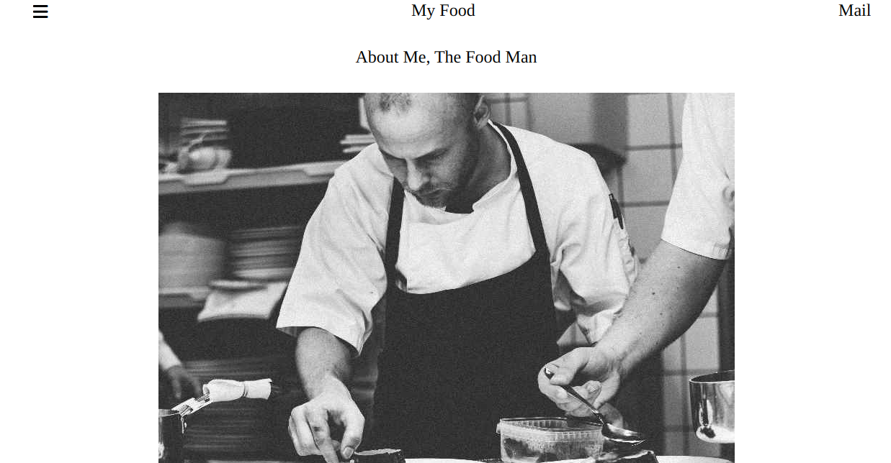

# Food-template project
We have created a food blog template website with three sections. The first section having the food cards, followed by the chefman picture on the following section and the last section containing a the following descriptions: footer, blog posts and popular tags.
## App

### Built With
- HTML
- CSS
### Prerequisites
Knowledge about:
- HTML
- CSS
- Google chrome
## Clone project
- To get a local copy up and running follow these simple example steps.
- Clone this repository with `git@github.com:Nathanael-Lontsi/Food-template.git` using your terminal.
- Change to the project directory by entering: cd Food-template in the terminal.
## steps
- $ git clone `git@github.com:Nathanael-Lontsi/Food-template.git`
- $ `cd Food-blog`
- $ `git checkout feature/footer`
## Start App
- run by opening the index.html in the browser
## Author
:bust_in_silhouette: **Nathanael-Lontsi**
- GitHub: [@Nathanael-Lontsi](https://github.com/Nathanael-Lontsi/Food-template)
## :handshake: Contributing
Contributions, issues, and feature requests are welcome!
Feel free to check the [issues page](https://github.com/Nathanael-Lontsi/Food-template/issues).
## :memo: License
This project is [w3school](./LICENSE) licensed.
